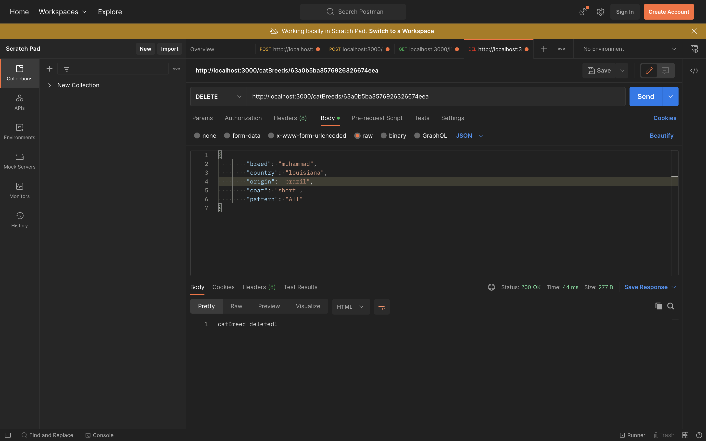

# Cat Breeds API
---

For my API project I did a Cat Breed API. My cat API gives the user the coat, origin, country and pattern of cat breeds.

---
### CRUD Functionality
Deleting a document from the collections of the database

Adding a document from the collections of the database

---
### Technologies Used 
- Express
- Mongoose
- Chalk
- Cors
- Morgan
- Node-fetch
- JavaScript
- nodemon
- MongoDB
- Node.js
### Sources
Original Seed Data: https://catfact.ninja/breeds